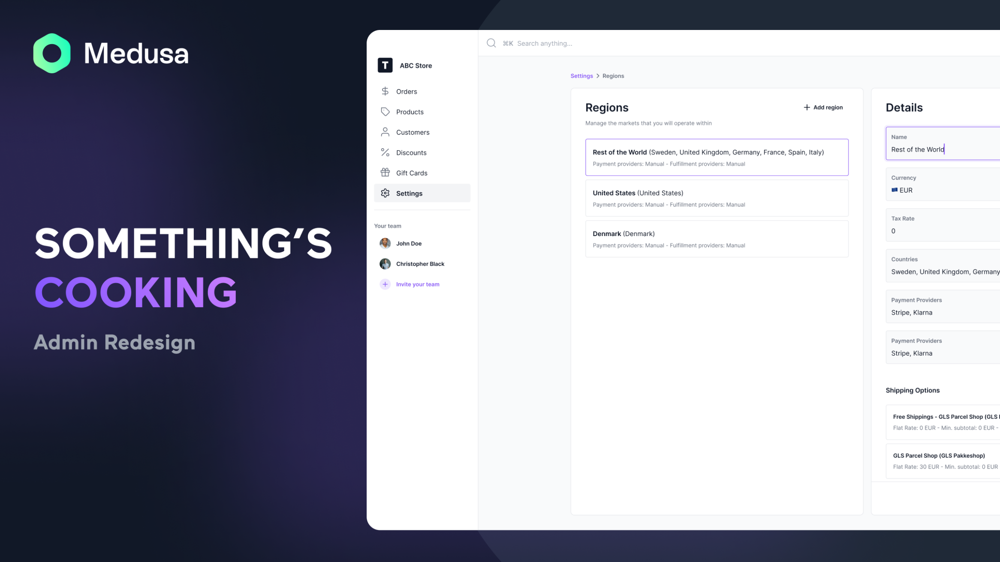
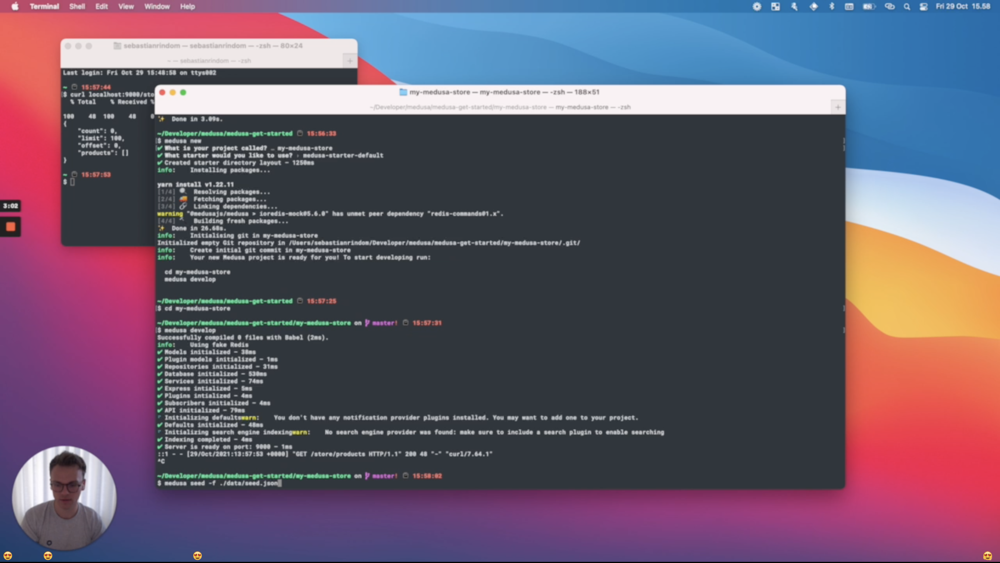

<!--lint disable awesome-list-item-->

  

    
  

<h1>Awesome MedusaJS</h1>

A curated list of awesome things related to MedusaJS

<a href="#resources">Resources</a>
&nbsp;&nbsp;&nbsp;
<a href="CONTRIBUTING.md">Contribution guide</a>
&nbsp;&nbsp;&nbsp;
<a href="https://docs.medusajs.com/">Official documentation</a>

  

## Contents <!-- omit in toc -->

- [News](#news)
- [Resources](#resources)
- [Video](#video)
- [Projects using MedusaJS](#projects-using-medusajs)
- [Starters Plugins](#starters-plugins)
  - [Starters](#starters)
  - [Plugins](#plugins)
- [Contribute](#contribute)

<!--lint enable awesome-list-item-->

## News

The Medusa team is still working hard, here is an admin revemp that will coming soon.

## Resources

- Information
    - [Notion](https://medusajs.notion.site/medusajs/Medusa-Home-3485f8605d834a07949b17d1a9f7eafd)

- Official Resources
  - [Website](https://www.medusajs.com/)
  - [Official Guide](https://docs.medusajs.com/)
  - [GitHub Repo](https://github.com/medusajs/medusa)
    - [Gatsby starter](https://github.com/medusajs/gatsby-starter-medusa)
    - [Nextjs starter](https://github.com/medusajs/nextjs-starter-medusa)
    - [Gatsby Medusa express](https://github.com/medusajs/medusa-express-gatsby)
    - [Nextjs Medusa express](https://github.com/medusajs/medusa-express-nextjs)
  
- Community
  - [Discord](https://discord.gg/xpCwq3Kfn8)
  - [Twitter](https://twitter.com/intent/follow?screen_name=medusajs)
  - [Twitch](https://www.twitch.tv/medusajs)

- Tutorials
  - [Official tutorials](https://www.medusajs.com/blog)
  - [Documentatuib tutorials](https://docs.medusajs.com/tutorial/set-up-your-development-environment)
  
### Video

## Projects using MedusaJS

- Open Source

## Starters Plugins

### Starters

- Official
    - [Gatsby starter](https://github.com/medusajs/gatsby-starter-medusa)
    - [Nextjs starter](https://github.com/medusajs/nextjs-starter-medusa)
    - [Gatsby Medusa express](https://github.com/medusajs/medusa-express-gatsby)
    - [Nextjs Medusa express](https://github.com/medusajs/medusa-express-nextjs)
- Third party
    - [Plugin starter (Typescript)](https://github.com/adrien2p/medusa-plugin-starter-ts)
    - [next-medusa-tailwind-template](https://github.com/avneesh0612/next-medusa-tailwind-template)

### Plugins

- Official
    - CMS
        - [Contentful](https://docs.medusajs.com/add-plugins/contentful)
        - [Strapi](https://docs.medusajs.com/add-plugins/strapi)
    - Analytics
        - [Segment](https://docs.medusajs.com/add-plugins/segment)
    - Search
        - [Meilisearch](https://docs.medusajs.com/add-plugins/meilisearch)
        - [Algolia](https://docs.medusajs.com/add-plugins/algolia)
    - File
        - [Spaces](https://docs.medusajs.com/add-plugins/spaces)
        - [S3](https://docs.medusajs.com/add-plugins/s3)
        - [Minio](https://github.com/medusajs/medusa/tree/master/packages/medusa-file-minio)
    - Loader
        - [Shopify](https://github.com/medusajs/medusa/blob/master/packages/medusa-source-shopify/src/loaders/index.js)
    - Invoice
        - [Economic](https://github.com/medusajs/medusa/tree/master/packages/medusa-plugin-economic)
    - Discount
        - [Generator](https://github.com/medusajs/medusa/tree/master/packages/medusa-plugin-discount-generator)
    - Inventory
        - [Brightpearl](https://github.com/medusajs/medusa/tree/master/packages/medusa-plugin-brightpearl)
    - Payment
        - [Manual](https://github.com/medusajs/medusa/tree/master/packages/medusa-payment-manual)
        - [Stripe](https://docs.medusajs.com/add-plugins/stripe)
        - [Klarna](https://docs.medusajs.com/add-plugins/klarna)
        - [Paypal](https://docs.medusajs.com/add-plugins/paypal)
        - [Adyen](https://github.com/medusajs/medusa/tree/master/packages/medusa-payment-adyen)
    - Fullfilment
        - [Manual](https://github.com/medusajs/medusa/tree/master/packages/medusa-fulfillment-manual)
        - [Webshiper](https://github.com/medusajs/medusa/tree/master/packages/medusa-fulfillment-webshipper)
    - Notification
        - [Sendgrid](https://docs.medusajs.com/add-plugins/sendgrid)
        - [Mailchimp](https://github.com/medusajs/medusa/tree/master/packages/medusa-plugin-mailchimp)
        - [Twilio](https://github.com/medusajs/medusa/tree/master/packages/medusa-plugin-twilio-sms)
    - Customer
        - [Wish list](https://github.com/medusajs/medusa/tree/master/packages/medusa-plugin-wishlist)
    - Bot
        - [Slack](https://docs.medusajs.com/add-plugins/slack)

- Third party
   - File
        - [Cloudflare Images](https://github.com/drewdecarme/medusa-file-cloudflare-images)
        - [Local Storage](https://github.com/blechlawine/medusa-plugin-filestorage-local)

## Contribute

Contributions welcome! Read the [contribution guidelines](CONTRIBUTING.md) first.
